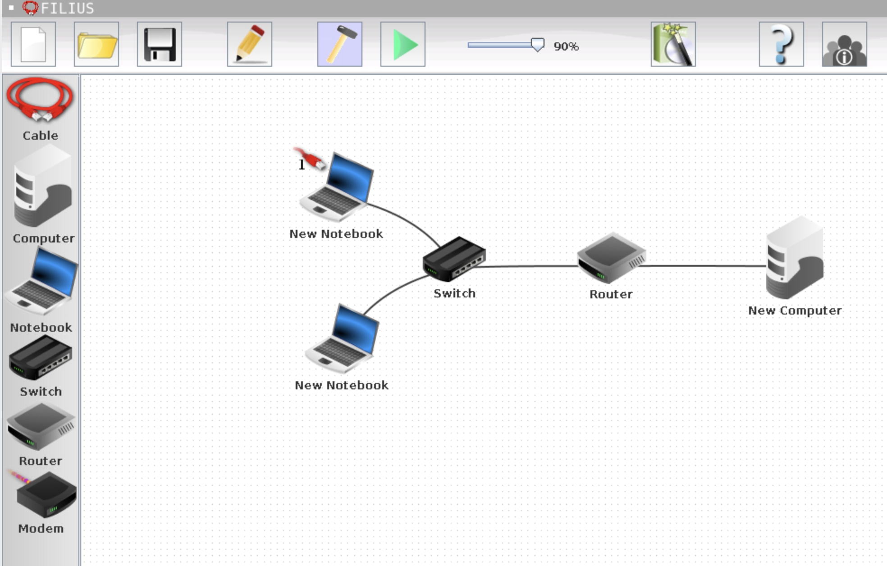

# Filius mit Tablets

Mit diesem Repository kann Filius in Replit gestartet werden. Filius ist eine Lernanwendung zu Rechnernetzen.

Klicken Sie auf das Bild, um Filius in Replit zu öffnen. Es ist kein Replit-Konto erforderlich, aber Sie können nichts speichern.

## Filius starten
- Drücken Sie die grüne Schaltfläche „Ausführen“ in Replit. Filius wird angezeigt.
- Bringen Sie die Registerkarte in Replit, welche Filius enthält (die Registerkarte heisst Ausgabe), in den Vollbildmodus. Klicken Sie auf die drei Punkte oben rechts auf der Registerkarte und klicken Sie im angezeigten Menü auf „Maximieren“.
- Klicken Sie auf das Symbol für ein grosses Fenster oben rechts in Filius. Das Symbol befindet sich links vom Kreuz zum Schliessen.

Viel Spass!

## Eigenes Replit erstellen
Somit können Dateien in Filius gespeichert werden.

- Klicke 'Create' in Replit
- Klicke 'import from Github'
- Wähle den Tab 'From URL' aus
- Verwende die URL: https://github.com/nairboon/filius-replit
- Wähle unter 'Language' die Sprache 'Bash'
- Klicke 'Import'
- Klicke grünen 'Run' Knopf

